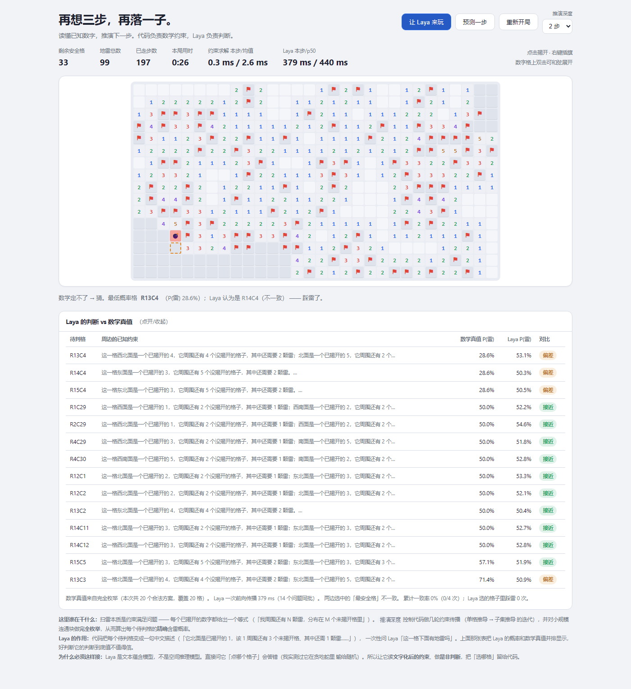

# Laya Minesweeper

用 [Laya](https://github.com/NandhaKishorM/laya) 玩扫雷 —— 但架构上做了个刻意的设计:

> **代码负责数学, Laya 负责判断。**



---

## 先说结论(重要)

这个项目做了件可能和你预期相反的事。实测下来:

| | 表现 |
|---|---|
| 约束求解器 | 能精确算出每格的含雷概率, 自动通关 |
| **Laya** | **几乎恒定输出 ~51%, 没有判断力** |

界面上那张「Laya 的判断 vs 数学真值」对比表就是这个结论的证据。同一局里:

```
数学真值 21.0%  →  Laya 51.6%
数学真值 21.0%  →  Laya 50.6%
数学真值 21.0%  →  Laya 52.9%
```

十几个概率完全不同的格子, Laya 全给 ~51%。它**不区分**。

这不是接线错误 —— 是模型的适用范围问题。Laya 是文本蕴含模型(encoder + 分类头),
擅长「这段文本属于哪个类别」, 不擅长空间推理。同类现象我在贪吃蛇上也测到过:
问它「该往哪拐」每个 checkpoint 都答反, 换成问「鸟在缺口上面还是下面」才有干净的分级答案。

**所以本项目的价值不是"让 AI 玩扫雷", 而是把"它在哪不行"量化给你看。**
对比表存在的意义就是让你亲眼验证, 而不是听我说。

---

## 快速开始

### Windows

```cmd
双击 run.bat
```

### macOS / Linux

```bash
./run.sh
```

### 手动(推荐, 可控性最好)

```bash
python -m venv .venv
.venv/bin/pip install laya          # Windows: .venv\Scripts\pip install laya
python server.py                    # 然后打开 http://127.0.0.1:8080/
```

首次运行会从 Hugging Face 下载权重(约 650 MB), 之后走本地缓存。

### 常用参数

```bash
python server.py --port 9000                    # 换端口
python server.py --model multilingual           # 换 checkpoint
python server.py --model typed-decisions
python server.py --model /path/to/local/dir     # 完全离线, 用本地权重目录
python server.py --device cpu                   # 强制 CPU
python server.py --check                        # 只加载模型做自检, 不启服务
```

`--model` 也接受完整的 HF 仓库名, 例如 `convaiinnovations/laya`。

> **国内网络提示**: 如果 `huggingface.co` 连不上, 可以先在能连通的环境下把权重的
> `model.safetensors` / `rl_agent_config.json` / `tokenizer/` / `encoder/` 放到一个目录,
> 然后用 `--model /该目录` 完全离线运行。本项目的 `--model` 支持本地目录就是为了这个。

---

## 这是怎么工作的

### 扫雷的本质

每个**已揭开**的数字都是一条约束:

> 「我周围还有 N 颗雷, 分布在 M 个未揭开的格子里」

把这些约束收集起来, 就是一个约束满足问题。求解分四步:

| 步骤 | 做什么 | 复杂度 |
|---|---|---|
| 规则 1/2 | 单格推导: 约束需要 0 颗雷 → 全安全; 需要 M 颗且正好 M 个格 → 全是雷 | O(n) |
| 规则 3 | 子集推导: 若 A 的格子集是 B 的子集, 则 B\A 需要 `B.need - A.need` 颗 | O(n²) |
| 规则 4 | 对剩余约束的**连通块做完全枚举**, 得到每格的**精确**含雷概率 | O(2^cap) |
| 兜底 | 枚举上限外的格子, 用「全局剩余雷数 / 全局剩余格数」估计 | O(n) |

规则的迭代轮数就是界面上的 **推演深度**。

### Laya 在哪一步介入

只有当**约束求解无法确定**任何格子时(必须猜), 才会:

1. 把每个待判格写成一句中文:
   > 「这一格西北面是一个已揭开的 3, 它周围还有 5 个没揭开的格子, 其中还需要 3 颗雷」
2. 把这十几句话**合并成一个请求**发给 Laya(一次前向传播回答全部问题)
3. 页面把 Laya 的 P(雷) 和数学真值**并排显示**

代码**不采纳** Laya 的判断 —— 决策仍以数学为准。Laya 的输出只用于对比展示。

### 为什么合并成一个请求

Laya 的一次 `predict` 调用可以同时回答任意多个问题, 共享同一次前向传播。
扫雷一步最多 14 个待判格, 分成 14 次请求会慢 14 倍。

---

## 实测数据

### 推演深度有用吗 —— 2 以上完全没用

5 个固定中局 × 4 种深度, 取平均:

| 深度 | 必然安全格 | 枚举格 | 合法方案 | 耗时 |
|---|---|---|---|---|
| 1 | 0.0 | 13.0 | 5.0 | 10.6 ms |
| **2** | **13.0** | 0.0 | 0.0 | 8.9 ms |
| 3 | 13.0 | 0.0 | 0.0 | 8.3 ms |
| 4 | 13.0 | 0.0 | 0.0 | 9.4 ms |

- **深度 1 → 2 有意义**: 多找出 13 个必然安全格(需要两轮约束传播才能推导出来)
- **深度 2 → 3 → 4 数字逐位相同**: 约束在第 2 轮就收敛了, 再迭代没有新信息
- 耗时也没差别

所以界面上默认是 **2 步**。3/4 是多余的。

> 有趣的反直觉点: 深度 1 的枚举格反而更多(13 vs 0)。因为迭代少时留下的约束块更小、
> 更容易枚举; 深度 2 把约束推干净了, 反而不需要枚举。两条路殊途同归。

### 性能

单步耗时(状态栏实时显示, 求解与推理分开):

| 环节 | 耗时 |
|---|---|
| 约束求解 | 0.3 ~ 42 ms(取决于是否需要枚举) |
| **Laya 推理(14 个问题同批)** | **380 ~ 930 ms** |

瓶颈明显在推理 —— 比求解慢 **100 倍以上**。这也说明为什么"把决策交给数学"是对的。

---

## 文件结构

```
.
├── server.py           # 后端: 标准库 HTTP + laya 推理, 约 250 行
├── static/
│   └── index.html      # 扫雷页面: 约束求解器 + UI, 全部内联, 零外部依赖
├── run.bat             # Windows 启动脚本
├── run.sh              # macOS / Linux 启动脚本
└── shot.png            # 截图
```

`static/index.html` 是**完全自包含**的 —— 没有 CDN、没有构建步骤、没有 npm。
里面的约束求解器和界面逻辑都是原生 JS, 直接读源码就能改。

---

## 操作

| 操作 | 说明 |
|---|---|
| 左键点击 | 揭开格子 |
| 右键点击 | 插旗 / 取消旗 |
| 双击已揭开的数字 | 和弦展开(周围旗数够了才生效) |
| 让 Laya 来玩 | 自动模式 |
| 预测一步 | 单步, 停下来看对比表 |
| 推演深度 | 约束迭代轮数, **2 就够** |

---

## 后端 API

只有两个接口, 都很简单:

### `GET /api/health`

```json
{"state": "ready", "model": "english", "device": "cuda", "load_s": 13.4, "error": null}
```

`state` 取值: `pending` / `loading` / `ready` / `error`

### `POST /api/predict`

请求:

```json
{
  "state": "扫雷棋盘：30 列 16 行，一共埋了 99 颗雷……",
  "questions": {
    "c_3,1": {
      "type": "noul",
      "instructions": "第 4 行第 2 列这一格下面有地雷吗？……",
      "criteria": {"true": "这一格下面有地雷", "false": "这一格下面没有地雷"}
    }
  },
  "model": "typed-decisions"
}
```

响应:

```json
{
  "answers": {"c_3,1": {"type": "noul", "noul": 0.647, "confidence": 0.647}},
  "latency_ms": 463.2,
  "device": "cuda",
  "routing": {"model": "typed-decisions"}
}
```

和上游 [laya-playground](https://github.com/wdobry/laya-playground) 的接口形状一致,
所以这个后端可以互换使用。

---

## 已知限制

- **Laya 的判断不可用**(见上文实测)。项目保留它只是为了展示对比。
- 扫雷本身是 **NP 完全**问题。约束求解器能处理的局面有限, 超出部分只能猜;
  猜测时踩雷是正常的, 不是 bug。
- 大棋盘上多数约束会连成**一个超大连通块**, 超过枚举上限。项目里做了子块拆分
  (`splitGroup`), 能算多少算多少, 拆不动的格子退化为全局估计。
- 只绑定 `127.0.0.1`, 不做鉴权, 也不适合对外提供服务。

---

## 许可与致谢

- **[Laya](https://github.com/NandhaKishorM/laya)** 由 [Nandakishor M](https://github.com/NandhaKishorM)
  (Convai Innovations) 创建, Apache-2.0。模型与权重归他所有, 本项目只是调用方。
- 本项目代码 MIT。
